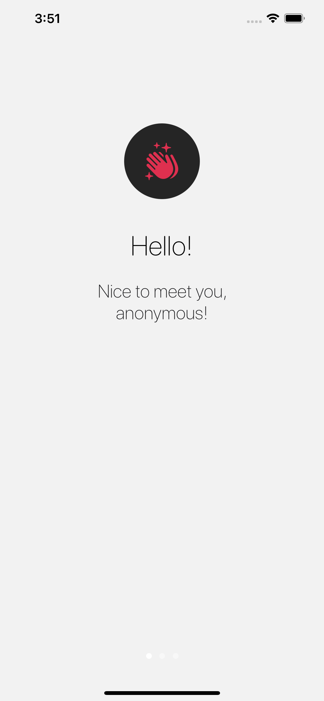
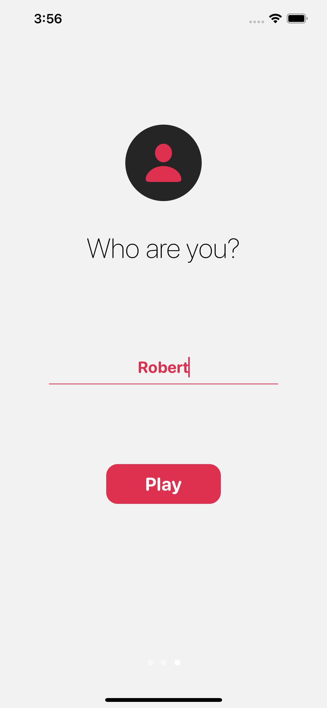

## BrainStress Quizzes

BrainStress Quizzes is a simple iOS app that's purpose is to work more like a coffee. Open the app, get angry! You can choose between quizzes such as:

1. Math
  - Additions
  - Subtractions
  - Multiplications
  - Divisions
2. Geography
  - Guess the Capital
3. Corporate
  - Guess the Company (motto based)

More quizzes will be added in the next update.

# How does the app look like

We're a small team doing great things :) we hope. Anyway, as we're mainly developers, we have no UI/UX colleague. Sketch is our friend. We built this UI (as developers) so you might encounter some difficulties using it. We did not find any inconveniences yet, but we also have no tester. 😎 We only test in production.

# Screens

## Onboarding Screens

We send no data to servers. What happens on your iPhone, stays on your iPhone.

Light              |  Dark 
:-------------------------:|:-------------------------:|
 | 
 | 
 | 

## Home Screen

Light              |  Dark 
:-------------------------:|:-------------------------:|
 | 

## Game Screens

Light              |  Dark 
:-------------------------:|:-------------------------:|
 | 
 | 
 | 

